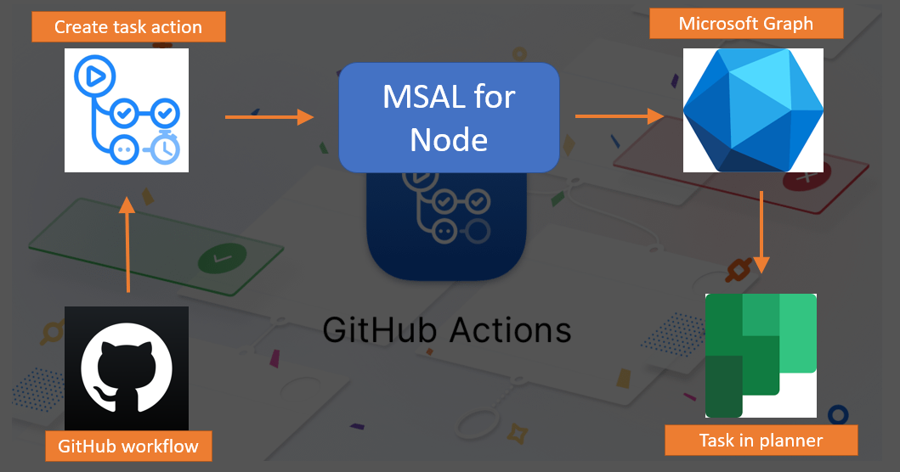
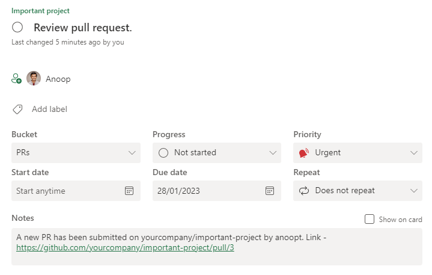

# GitHub Action to create a task with Microsoft Graph using MSAL

This action creates a planner task and assigns it to a user. This action can be used when say for example a pull request is created and some one has to review it. The task that gets created will have some details about the pull request.

## What it does



## Pre requisites

This action uses Microsoft Graph to create a task. So please make sure that you [register an application in Azure AD](https://docs.microsoft.com/en-us/graph/auth-register-app-v2), provide that app `Tasks.ReadWrite.All` permissions and create a client secret for that.

In your GitHub repo [create 4 secrets](https://help.github.com/en/actions/automating-your-workflow-with-github-actions/creating-and-using-encrypted-secrets) with the following information:

* CLIENT_ID - The Id of the app registration created above
* CLIENT_SECRET - A secret of the app registration created above.
* TENANT_ID - The Id of your Microsoft 365 tenant
* PLAN_ID - The Id planner plan where the task will be created

## Usage

Below is a workflow code

```workflow
name: Microsoft Graph Task

on: [pull_request]

jobs:
  create-task:
    runs-on: ubuntu-latest
    name: Create Task
    steps:
    - name: Create a task for the user
      uses: anoopt/ms-graph-create-task@v1
      with:
        clientId: ${{ secrets.CLIENT_ID }}
        clientSecret: ${{ secrets.CLIENT_SECRET }}
        tenantId: ${{ secrets.TENANT_ID }}
        planId: ${{ secrets.PLAN_ID }}
        title: "Review pull request."
        userId: "e5529803-90d6-422a-ad0d-85bfbad10348"
        description: "Please review the pull request. Link to the pull request ${{ github.event.pull_request.html_url }}."
```

In the above example, the userId is the Id of the user who will be assigned the task. You can get the Id of the user from their UPN using Graph Explorer. 

When there is a pull request, the above workflow will create a task for a user with id 'e5529803-90d6-422a-ad0d-85bfbad10348' due by the next week (automatic as no due date is specified).  

## More Information

All of the information attached to an event is available in the `github.event` variable. To see the possible values, you can use the following step in your workflow:

```yaml
- run: echo '${{ toJson(github.event) }}'
```

```workflow
name: Microsoft Graph Task

on: [pull_request]

jobs:
  create-task:
    runs-on: ubuntu-latest
    name: Create Task
    steps:
    - name: Create task on the specified date and time
      uses: anoopt/ms-graph-create-task@v1
      with:
        clientId: ${{ secrets.CLIENT_ID }}
        clientSecret: ${{ secrets.CLIENT_SECRET }}
        tenantId: ${{ secrets.TENANT_ID }}
        planId: ${{ secrets.PLAN_ID }}
        title: "Review pull request."
        userId: "e5529803-90d6-422a-ad0d-85bfbad10348"
        bucketId: "Ys2XyYjrnkCQDmOZEJ8KDZcADKs9"
        dueByDate: "2023-01-28"
        dueByTime: "10:00"
        description: "A new PR has been submitted on ${{ github.repository }} by ${{ github.actor }}. Link to the pull request ${{ github.event.pull_request.html_url }}."
        priority: "1"
```

In the above example, the userId is the Id of the user who will be assigned the task. You can get the Id of the user from their UPN using Graph Explorer. 

When there is a pull request, the above workflow will create a task for a user with id 'e5529803-90d6-422a-ad0d-85bfbad10348' due by 28th Jan 2023 10AM. The task will be created in the bucket with Id 'Ys2XyYjrnkCQDmOZEJ8KDZcADKs9' and the priority will be set to 1 (urgent). The description will have the details of the pull request.

## Task that gets created

